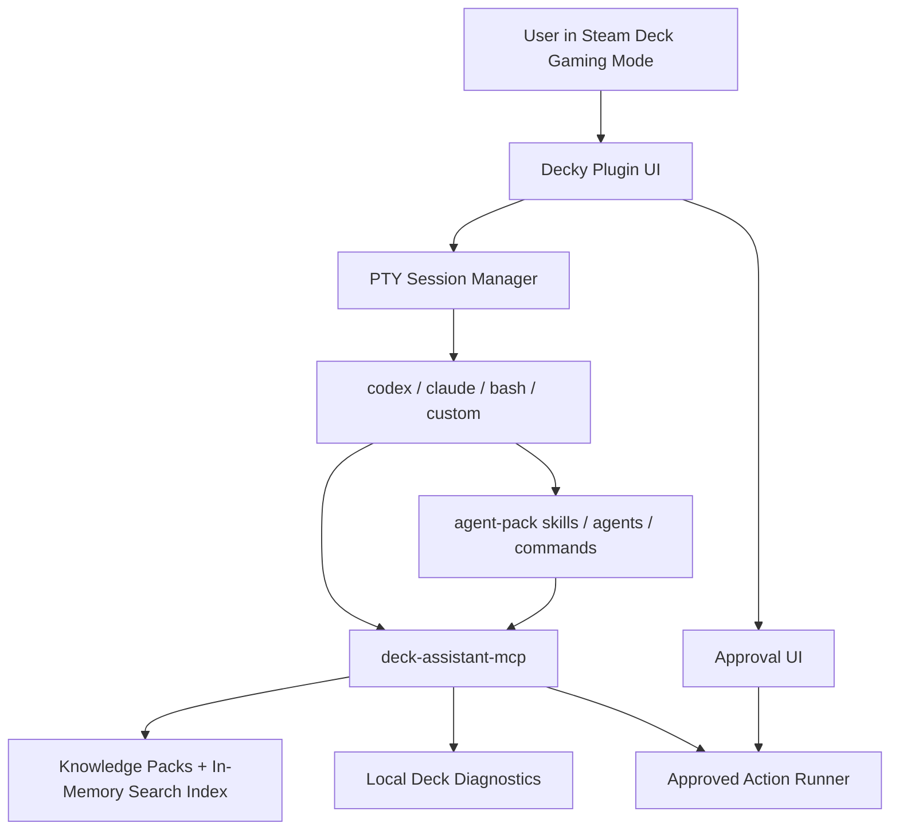

# Architecture

## System Shape

- The Steam Deck runs the Decky plugin, PTY sessions, local diagnostics, knowledge indexes, action approvals, and command execution.
- AI model access stays inside the user's official CLI tools by default.
- Knowledge packs are local files or downloaded static artifacts; hosted indexing is optional future work.
- MCP is the shared tool/data bridge for Codex, Claude, and other compatible agents where users choose to wire them manually.
- Repo-local agent pack assets define portable skills, role boundaries, commands, adapter templates, and MCP config examples so development and runtime agents share one safety model.

## Components

| Component | Responsibility | Source anchors |
| --- | --- | --- |
| Decky UI | Terminal Mode MVP with xterm.js, launchable-only plugin panel, route-based terminal page, route-based Settings pages for profiles, terminal display/input, voice, and diagnostics, managed CLI setup/auth controls, native assistant pack install controls for supported CLIs, explicit plugin update controls, explicit per-profile permission-bypass toggles, in-terminal auth-link Open/Copy actions, terminal toolbar controls, and one-button user-started external API voice input that records/stops without an extra panel; assistant, knowledge manager, and approvals planned | Terminal shell in [src/index.tsx](../src/index.tsx), [ROADMAP.md](../ROADMAP.md) |
| Python backend | PTY session lifecycle for up to eight built-in, stored custom, or transient setup sessions; profile and transient setup open-or-reattach calls; managed CLI setup action launcher; user-local native assistant pack installer; GitHub Release ZIP update planning plus a writable-install backend fallback; per-profile permission-bypass planner/settings; in-memory terminal auth-link and output-tail capture; custom profile JSON settings; terminal display/input config settings; voice-control config settings; external transcription config and bounded user-triggered transcription calls; smoke backend calls; bounded read-only diagnostics path planning; storage readers, Proton log readers, and local service lifecycle planned | Backend in [main.py](../main.py); initial PTY lifecycle contract in [packages/core/src/deck_assistant_core/pty_session.py](../packages/core/src/deck_assistant_core/pty_session.py), native pack installer in [packages/core/src/deck_assistant_core/agent_pack.py](../packages/core/src/deck_assistant_core/agent_pack.py), diagnostics contracts and readers in [packages/core/src/deck_assistant_core/diagnostics.py](../packages/core/src/deck_assistant_core/diagnostics.py), [ROADMAP.md](../ROADMAP.md) |
| CLI adapter layer | Detect, plan launch argv, plan managed latest-version npm setup actions, summarize profile health, classify CLI auth/health state without reading secrets, and apply explicit CLI-native permission-bypass args for Codex and Claude; custom commands are structured argv profiles with explicit risk posture | Initial contracts in [packages/core/src/deck_assistant_core/cli.py](../packages/core/src/deck_assistant_core/cli.py), [ROADMAP.md](../ROADMAP.md) |
| Knowledge manager | Define pack manifests, source metadata, source registry state, document, chunk, citation, deterministic manifest building from supplied contents or filtered UTF-8 local folders, deterministic local-folder inventory, pre-index file filtering, in-memory search, and persisted SQLite FTS5/BM25 search contracts; source fetching is planned | Initial contracts in the [packages/core/src/deck_assistant_core/knowledge/](../packages/core/src/deck_assistant_core/knowledge/) package (`contracts`, `filtering`, `chunking`, `manifest`, `search`), [ROADMAP.md](../ROADMAP.md) |
| MCP server | Stable static tool contract catalog, approval summary metadata, and in-process dispatcher shell with optional injected knowledge index, read-only diagnostics handlers/readers, and non-executing staged-action store, plus a dependency-free newline-delimited JSON-RPC 2.0 stdio transport (`python -m deck_assistant_mcp serve`) that wires real bounded diagnostics readers and refuses approval-gated execution; full knowledge-index wiring and audit are planned | [packages/mcp-server/src/deck_assistant_mcp/contracts.py](../packages/mcp-server/src/deck_assistant_mcp/contracts.py), [packages/mcp-server/src/deck_assistant_mcp/dispatcher.py](../packages/mcp-server/src/deck_assistant_mcp/dispatcher.py), [packages/mcp-server/src/deck_assistant_mcp/server.py](../packages/mcp-server/src/deck_assistant_mcp/server.py), [ROADMAP.md](../ROADMAP.md) |
| Action runner | Stage approval-ready actions in memory without execution credentials, issue opaque approval tokens only after Decky approval, and retrieve approved actions by matching ID/token/risk; execution, backup, rollback, and audit are planned | Initial contracts in [packages/core/src/deck_assistant_core/actions.py](../packages/core/src/deck_assistant_core/actions.py), [ROADMAP.md](../ROADMAP.md), [AGENTS.md](../AGENTS.md) |
| Agent pack | Skills, custom agents, workflow commands, target-native adapter templates, user-local native install assets, tool policy, conflict rules | [agent-pack/manifest.json](../agent-pack/manifest.json), [packages/core/src/deck_assistant_core/agent_pack.py](../packages/core/src/deck_assistant_core/agent_pack.py) |
| Pack registry | Static public pack metadata and release artifacts | [ROADMAP.md](../ROADMAP.md) |

## Data / Request Flow

1. User opens Decky panel in Gaming Mode.
2. User configures built-in or custom CLI profiles in the Settings route. Built-in Codex and Claude setup can install the latest npm package into `~/.local/share/decky-ai-assistant/npm` and open the official auth flow in a transient PTY.
3. For built-in Codex or Claude profiles, the user can explicitly install the bundled native assistant pack into that CLI's user-local extension path. The install is `low_write` and is not performed silently on Decky plugin install; after a successful install, the frontend requests a Decky plugin reload.
4. From Diagnostics settings, the user can explicitly check GitHub Releases for the latest compatible Decky ZIP and install it as a `low_write` plugin update. The backend validates the ZIP before replacing plugin files and the frontend requests a Decky plugin reload afterward.
5. User returns to the plugin panel and clicks a launchable profile. Missing built-in CLIs remain in Settings until installed.
6. Terminal Mode reattaches an existing running PTY for that profile or starts the selected CLI or shell, then navigates to a dedicated terminal route.
7. Assistant Mode sends user intent to the selected CLI through the terminal/session adapter or CLI-native command path. Terminal Mode can also record a user-started audio clip, send it to the configured external transcription endpoint, and insert returned text into any PTY without pressing Enter; Claude profiles can send `/voice tap` to delegate recording and transcription to Claude Code's native voice mode only when the user explicitly enables native voice.
8. The CLI calls `deck-assistant-mcp` for knowledge search, diagnostics, and staged actions.
9. Agent pack roles constrain whether the CLI is planning, diagnosing, reviewing safety, curating sources, or executing an approved action.
10. Read-only tools return structured results with citations.
11. Write actions are staged and displayed in Decky UI.
12. User approves or rejects the action.
13. Approved actions run locally on Deck with backups and audit logging where applicable.

## Storage And State

| Store | Data | Source anchors |
| --- | --- | --- |
| Decky settings | Stored custom CLI profiles in `custom-profiles.json`, per-profile permission-bypass settings in `profile-permissions.json`, terminal display/input/voice settings in `terminal-config.json`, and external transcription endpoint settings in `voice-transcription.json`; enabled packs and broader user preferences planned | Implemented in [main.py](../main.py) |
| Terminal auth links and replay | Recent HTTP(S) links plus a bounded output tail detected from PTY output, kept in process memory per terminal session for Open/Copy/Hide actions and terminal-route replay after browser/settings detours; helper links can be suppressed after successful auth or user dismissal without deleting replay; cleared on restart/stop; not persisted or logged | Implemented in [main.py](../main.py) and [src/index.tsx](../src/index.tsx) |
| Managed CLI install prefix | User-local Node.js bootstrap files, npm package installs, and profile workspaces under `~/.local/share/decky-ai-assistant/`, with executables resolved from the managed npm bin path and bootstrapped Node.js `bin` directories; CLI children normalize `HOME`/XDG auth, config, and cache locations to the user's home rather than a root-like runtime home; Codex and Claude launch from managed `workspaces/<profile>` directories when the native pack has created them so project trust and identity can persist outside the home directory; no system package manager or root path is used | Implemented in [packages/core/src/deck_assistant_core/cli.py](../packages/core/src/deck_assistant_core/cli.py) and [packages/core/src/deck_assistant_core/pty_session.py](../packages/core/src/deck_assistant_core/pty_session.py), launched by [main.py](../main.py) |
| Native assistant pack installs | User-confirmed Codex and Claude adapter assets written to user-local extension directories such as `~/.agents/plugins/decky-ai-assistant` and a self-contained Claude bundle under `~/.claude/plugins/decky-ai-assistant`; Codex receives a `./`-relative marketplace entry, global runtime skills under `~/.agents/skills/<skill>`, plugin-bundled `.mcp.json` metadata, and a stable managed workspace under `~/.local/share/decky-ai-assistant/workspaces/codex` whose managed `AGENTS.md` frames the session as the Steam Deck assistant and whose managed `.codex/config.toml` registers the local `deck-assistant` MCP server; Claude also receives direct user-level runtime skills under `~/.claude/skills/<skill>`, user-level agents under `~/.claude/agents/`, user-level commands under `~/.claude/commands/`, and a stable managed workspace under `~/.local/share/decky-ai-assistant/workspaces/claude` whose managed `CLAUDE.md` frames the session as the Steam Deck assistant and whose managed `.mcp.json` plus `.claude/settings.local.json` register and pre-enable the local `deck-assistant` MCP server; managed directories and files carry marker files and unmanaged existing paths are not overwritten | Implemented in [packages/core/src/deck_assistant_core/agent_pack.py](../packages/core/src/deck_assistant_core/agent_pack.py), launched by [main.py](../main.py) |
| Plugin update install | User-confirmed Decky Loader install/update prompt for the latest compatible GitHub Release ZIP under the `decky-ai-assistant` top-level directory; backend direct replacement remains a fallback for writable installs, validates required files/directories and install-target writability before writing, backs up existing touched top-level entries during replacement, and reports a recovery message without partial replacement when it cannot write | Implemented in [main.py](../main.py), launched by [src/pages/settings/DiagnosticsSettings.tsx](../src/pages/settings/DiagnosticsSettings.tsx) |
| CLI-owned auth stores | Provider tokens and sessions | Owned by Codex/Claude or custom user tools; plugin must not read. |
| External transcription API key | Optional BYO key for the configured transcription endpoint | Stored in Decky settings, never returned through the public frontend config payload, and unrelated to CLI auth tokens. |
| Knowledge index | Pack manifests, source metadata, licenses, revisions, manifest build results from supplied content or filtered local folders, deterministic local source inventories, chunks, citations, deterministic in-memory search results, and persisted SQLite FTS5/BM25 index files built from manifest document content; MCP can read an injected knowledge index through the shared search/manifest surface | Initial contracts in the [packages/core/src/deck_assistant_core/knowledge/](../packages/core/src/deck_assistant_core/knowledge/) package, [packages/mcp-server/src/deck_assistant_mcp/dispatcher.py](../packages/mcp-server/src/deck_assistant_mcp/dispatcher.py), [ROADMAP.md](../ROADMAP.md) |
| Knowledge source registry | Enabled/disabled source state, disabled reasons, source-listing payloads, and pack/document/index metadata for future settings persistence; registry operations are in-memory only and do not fetch, index, delete, or write artifacts | Initial contract in [packages/core/src/deck_assistant_core/knowledge/contracts.py](../packages/core/src/deck_assistant_core/knowledge/contracts.py), [ROADMAP.md](../ROADMAP.md) |
| Action staging store | Pending actions, risk levels, deterministic approval-plan rendering, non-secret staged metadata, Decky-issued approval token metadata, approval timestamps; MCP can create pending records when an in-memory store is injected, without releasing tokens or executing actions | In-memory core contract implemented in [packages/core/src/deck_assistant_core/actions.py](../packages/core/src/deck_assistant_core/actions.py), with dispatcher staging support in [packages/mcp-server/src/deck_assistant_mcp/dispatcher.py](../packages/mcp-server/src/deck_assistant_mcp/dispatcher.py); persistence and execution audit are planned |
| Audit log | Sanitized action history and diagnostics events | Planned |
| Pack registry cache | Static registry metadata and artifact hashes | Planned |
| Agent pack manifests | Skills, roles, command templates, adapter templates, tool policy | [agent-pack/manifest.json](../agent-pack/manifest.json) |

## External Dependencies

| Dependency | Used for | Source anchors |
| --- | --- | --- |
| Decky Loader | Plugin runtime in Gaming Mode | [ROADMAP.md](../ROADMAP.md) |
| xterm.js | Terminal rendering | [ROADMAP.md](../ROADMAP.md) |
| Python PTY APIs | Interactive process control | [ROADMAP.md](../ROADMAP.md) |
| Codex CLI | AI CLI target and extension host | [ROADMAP.md](../ROADMAP.md) |
| Claude Code | AI CLI target and extension host | [ROADMAP.md](../ROADMAP.md) |
| OpenCode | Reference architecture for terminal-first agent UX and MCP patterns | [ROADMAP.md](../ROADMAP.md) |
| GitHub Releases/Pages | Static pack hosting and plugin self-update ZIP source | [ROADMAP.md](../ROADMAP.md), [main.py](../main.py) |
| OpenAI-compatible transcription API | Optional user-configured voice transcription endpoint; disabled by default and called only after a push-to-talk recording action | [main.py](../main.py), [ROADMAP.md](../ROADMAP.md) |
| Agent skill hosts | Consume portable skills and target-native wrappers | [agent-pack/manifest.json](../agent-pack/manifest.json) |

## Invariants

- Local CLI auth remains local to the official CLI.
- Auth URLs detected in terminal output are kept only in memory for user Open/Copy actions and must not be persisted in settings or logs.
- Microphone capture must only start after a user action in the terminal route. Generic external transcription is disabled until the user configures an endpoint and key where required; it inserts text into the PTY without sending Enter. CLI-native voice remains owned by the target CLI and is opt-in.
- External transcription requests must be bounded, user-started, limited to the recorded audio clip plus configured language hint, and use verified TLS for HTTPS endpoints with system CA bundle discovery; API keys must not be logged or returned to the frontend.
- Managed setup may install or update official CLI npm packages and bootstrap a compatible Node.js runtime only in the user's home data directory; it must not use `sudo`, `pacman`, or system shell/profile edits.
- Custom terminal commands are stored and launched as structured argv, never opaque shell strings.
- Terminal PTY children and read-only CLI probe subprocesses include the managed npm bin path, discovered user-local Node.js bin paths, stable user-home/XDG auth/config/cache directories, and drop Decky/Steam dynamic library overrides before launching user shells and CLIs.
- MCP write tools require Decky-side approval before execution unless the owner explicitly enabled per-profile bypass for the active CLI session.
- CLI permission bypass is disabled by default, visible in Settings, classified as `danger`, and maps only to documented CLI-native no-approval modes; the Decky plugin still does not run as root by default.
- Read-only diagnostics are the default.
- Knowledge results must carry source and license metadata.
- Knowledge source indexing must filter files deterministically before chunking; the default per-file limit is 256 KiB.
- Local-folder knowledge pack builds must read only files that passed deterministic source filtering and collection limits.
- Background work is opt-in and bounded.
- The open-source local path must remain usable without hosted infrastructure.
- `AGENTS.md` and `agent-pack/tool-policy.json` define the shared safety model; target adapters must not weaken it.

## Boundaries

- The plugin may launch CLIs; it must not impersonate their auth flows.
- The plugin may expose voice controls and call a user-configured transcription endpoint, but it must not implement a hosted transcription proxy, read provider voice settings, reuse CLI auth credentials, or auto-enable microphone capture in the background.
- The MCP server may expose local tools; it must not bypass Decky approval for writes in the default path.
- Per-profile permission bypass may start supported CLIs with documented no-approval flags after the owner enables it in Settings; existing sessions must be restarted to apply the changed argv.
- Native assistant pack installation may write user-local CLI extension files after explicit confirmation; it must not run provider CLIs, read auth stores, or grant elevated permissions.
- The knowledge manager may fetch public sources; it must not upload private sources by default.
- Hosted services may help with indexing later; they must not execute commands on the user's Deck.
- Target-native agent adapters may package skills and MCP config, but portable skills remain the source of shared workflow behavior.
- Terminal sessions stay alive while the Decky panel or non-terminal settings pages are closed; the user must close a session explicitly, and plugin unload still stops child PTYs.
- The Terminal Mode plugin may import repo-local core/MCP Python packages from the deployed plugin directory for development testing; release packaging must keep this as an explicit bundle step and include `agent-pack`, docs, and host instruction files for native assistant pack installs.
